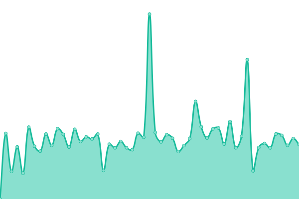
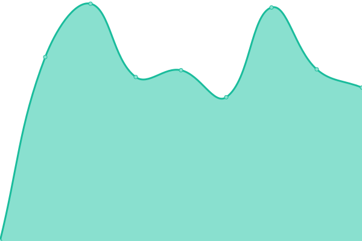
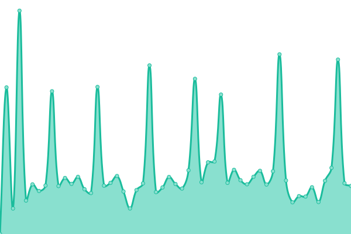

<!--start: status pages-->
<!-- This summary is generated by Upptime (https://github.com/upptime/upptime) -->
<!-- Do not edit this manually, your changes will be overwritten -->
<!-- prettier-ignore -->
| URL | Status | History | Response Time | Uptime |
| --- | ------ | ------- | ------------- | ------ |
|  [https://thinkingschool.vn](https://thinkingschool.vn) | 🟩 Up | [https-thinkingschool-vn.yml](https://github.com/thinkingschool/upptime/commits/HEAD/history/https-thinkingschool-vn.yml) | 

 2360ms
     
 | 

<a href="https://thinkingschool.github.io/upptime/history/https-thinkingschool-vn">100.00%</a>
    

|  [https://lms.thinkingschool.vn](https://lms.thinkingschool.vn) | 🟩 Up | [https-lms-thinkingschool-vn.yml](https://github.com/thinkingschool/upptime/commits/HEAD/history/https-lms-thinkingschool-vn.yml) | 

 2296ms
     
 | 

<a href="https://thinkingschool.github.io/upptime/history/https-lms-thinkingschool-vn">100.00%</a>
    

|  [https://thinkingschool.edu.vn](https://thinkingschool.edu.vn) | 🟩 Up | [https-thinkingschool-edu-vn.yml](https://github.com/thinkingschool/upptime/commits/HEAD/history/https-thinkingschool-edu-vn.yml) | 

 3265ms
     
 | 

<a href="https://thinkingschool.github.io/upptime/history/https-thinkingschool-edu-vn">100.00%</a>
    

<!--end: status pages-->
